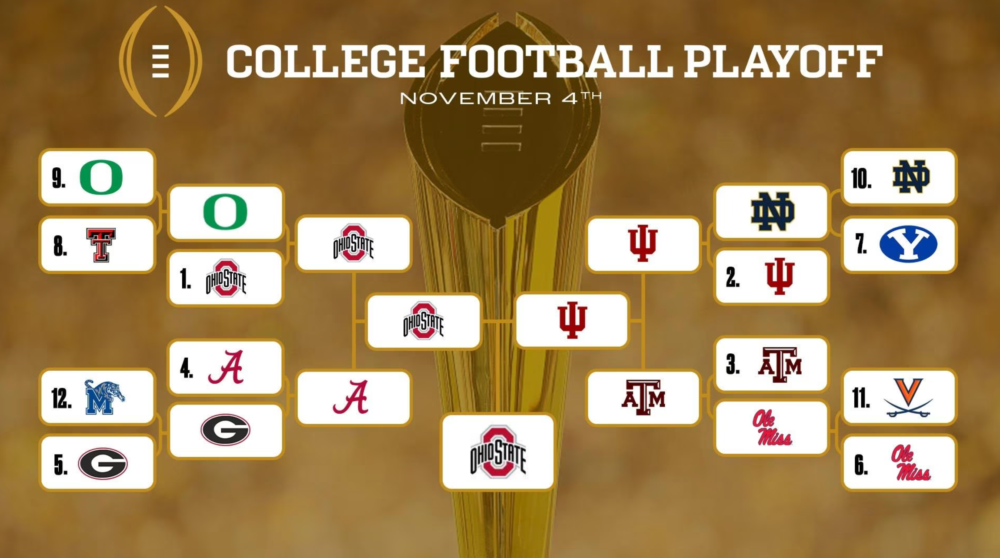
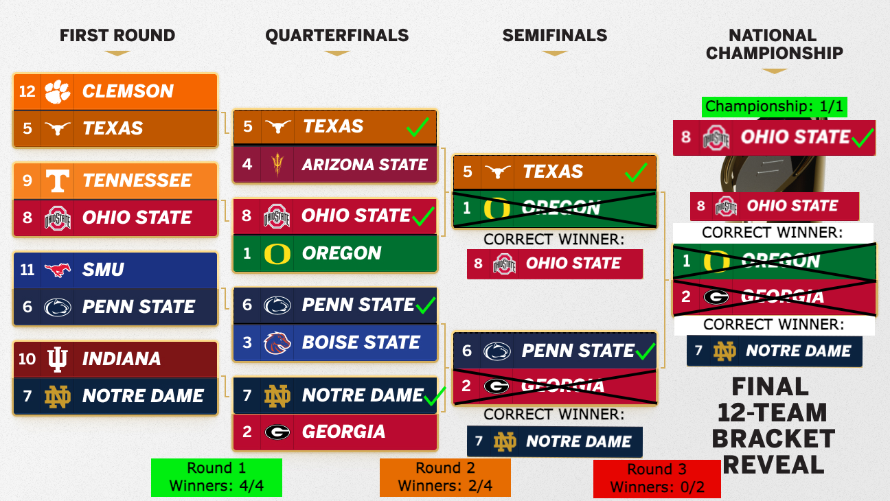

# Simulating the College Football Playoff with a Bradley–Terry Model

## Executive Summary

In college football’s newly expanded playoff system, understanding a team’s championship probability matters just as much as understanding a team’s seeding. For our project, we aimed to find out if the College Football Playoff started today, and which teams would actually have the best shot at coming out on top. The new 12-team format introduced many complexities that the traditional rankings don’t capture. The top four teams get crucial first-round byes, another four host home games, and the remaining four face elimination immediately. We wanted to minimize the noise of team rankings to provide quantitative championship odds based on team strength data, giving stakeholders and fans across college football a picture of who should be planning championship parades and who is gonna need some extra luck. We used data from the CFB Fast R-package, utilizing four major analytical systems that evaluate team quality: ESPN’s Football Power Index, SP+ efficiency metric, Elo’s dynamic ratings, and the Simple Rating System. Rather than picking one system to focus on, we transformed each metric into standardized scores to make a composite measure, ensuring balanced input from predictive models, momentum-based rankings, and margin evaluations. This gave us a single strength rating for each of the 12 playoff teams drawn from the November 4th CFB rankings. From there, we implemented a Bradley-Terry model to calculate win probabilities for each matchup, ran 500 complete tournament simulations from first-round kickoffs through the championship game in an attempt to map out the probability landscape.

What we discovered was a pretty chalk playoff picture, yet stil filled with more variability than you’d expect. Ohio State sits atop the probability leaderboard, claiming the championship in roughly 27% of simulations, but still not guaranteed. Indiana trails closely with 24% title odds, while Alabama and Texas A&M each hover around 11%. These four bye recipients combine to win nearly three-quarters of all championships in our model. The next tier teams, like Oregon, Georgia, and Notre Dame, each win between 6-7% of the time, holding real but slim chances. Beyond that, lower seeds face rough odds: Memphis, Virginia, and BYU combined win fewer than one championship per hundred tournaments. We also found that hosting a first-round playoff game provides a tangible edge, with home teams advancing 55-60% of the time, though this falls well short of guaranteeing victory. One interesting thing we noted was that even favored Ohio State loses the championship in nearly three of every four tournament runs, demonstrating how playoff randomness can derail even the best programs.

The takeaways are significant for anyone invested in college football success. Securing a top-four seed and bye doesn’t just mean an easier path; it transforms championship probability, almost tripling your odds. For programs on the bubble, the difference between seed 4 and seed 5 represents a massive difference in championship equity. While our analysis has room to grow. Future iterations could incorporate team-specific pressure effects and even injuries. Which could lead to an even more accurate way to predict the 2025 CFB National Champions.

## Introduction

We use a simple Bradley–Terry (BT) model to convert composite team ratings into win probabilities and simulate the 12-team CFP bracket. Ratings come from FPI, SP+, Elo, and SRS (z-scored and averaged). The BT probability for team *i* vs *j* is $p_{i,j} = \sigma(\beta_i - \beta_j), \quad \sigma(x) = \frac{1}{1+e^{-x}}$ We show results for 2025 and a 2024 back-test for comparison.

```{r}
Sys.setenv(CFBD_API_KEY = "ITEs7pbYz8z66o4ksvNMW2m31B2ZPCnC+dbIXj2tT1mjMmJx02Dd9MM0fZpNhAyO")

library(cfbfastR)
library(ggplot2)
library(dplyr)
```

## Data Cleaning

We start by adding in the 12 teams that would be in the College Football Playoffs if they started today and then pulling metrics for each team from the cfbfastR package. We used the metrics FPI, SP+, Elo, and SRS because they are strong predictors of team strength. We z-scored and averaged these to make a composite score which is then what we used as our lambdas for the Bradley-Terry model.

```{r}
teams = c("Ohio State", "Indiana", "Texas A&M", "Alabama", "Georgia", "Ole Miss", "BYU", "Texas Tech", "Oregon", "Notre Dame", "Virginia", "Memphis")


fpi <- cfbd_ratings_fpi(year = 2025) |> dplyr::transmute(team, fpi)
sp  <- cfbd_ratings_sp(year = 2025)  |> dplyr::transmute(team, sp = rating) |> dplyr::filter(team != "nationalAverages")
elo <- cfbd_ratings_elo(year = 2025) |> dplyr::transmute(team, elo)
srs <- cfbd_ratings_srs(year = 2025) |> dplyr::transmute(team, srs = rating)

z_scores <- fpi |> dplyr::full_join(sp,  by = "team") |> dplyr::full_join(elo, by = "team") |> dplyr::full_join(srs, by = "team") |> tidyr::drop_na() |>
  dplyr::mutate(
    z_fpi = as.numeric(scale(fpi)),
    z_sp  = as.numeric(scale(sp)),
    z_elo = as.numeric(scale(elo)),
    z_srs = as.numeric(scale(srs)),
    composite = (z_fpi + z_sp + z_elo + z_srs)/4
  )

ratings_com = c()
for (t in teams) {
  rating = (z_scores |> dplyr::filter(team == t))$composite[1]
  cat(t, ": ", rating, "\n", sep="")
  ratings_com = c(ratings_com, rating)
}

probs_com <- 1/(1 + exp(-1 * outer(X = ratings_com, Y = ratings_com, FUN = "-")))
diag(probs_com) <- NA
round(probs_com, digits = 3)

z_scores
```

## Bracket:

Round 1 hosts are seeds 5–8 vs 12–9. Then 1 vs 8/9 winner, 4 vs 5/12, 2 vs 7/10, 3 vs 6/11, followed by semifinals and championship. We run 500 Monte Carlo simulations, using our probability matrix for each matchup and tally wins by round.

```{r}
design <- 
  data.frame(home_team = c(5, 6, 7, 8), away_team = c(12, 11, 10, 9)) |>
  dplyr::rowwise() |>
  dplyr::mutate(prob = probs_com[home_team, away_team]) |>
  dplyr::ungroup()

n_sims <- 500
simulated_wins_r1 <- matrix(data = NA, nrow = n_sims, ncol = 12)
simulated_wins_r2 <- matrix(data = NA, nrow = n_sims, ncol = 12)
simulated_wins_r3 <- matrix(data = NA, nrow = n_sims, ncol = 12)
simulated_champs <- matrix(data = NA, nrow = n_sims, ncol = 12)
for(r in 1:n_sims){
  set.seed(478+r)
  outcomes <- rbinom(n = 4, size = 1, prob = design$prob)
  round1 <-
    design |>
    dplyr::select(home_team, away_team) |>
    dplyr::mutate(
      outcome = outcomes,
      winner = ifelse(outcome == 1, home_team, away_team),
      winner = factor(winner, levels = 1:12)) |>
    dplyr::group_by(winner) |>
    dplyr::summarise(Wins = dplyr::n()) |>
    dplyr::rename(Team = winner) |>
    tidyr::complete(Team, fill = list(Wins = 0))
  
  simulated_wins_r1[r,] = round1 |> dplyr::pull(Wins)
  
  winner_512 = ifelse(round1$Wins[5] == 1, 5, 12)
  winner_611 = ifelse(round1$Wins[6] == 1, 6, 11)
  winner_710 = ifelse(round1$Wins[7] == 1, 7, 10)
  winner_89 = ifelse(round1$Wins[8] == 1, 8, 9)
  
  design2 <- 
    data.frame(high_seed = c(1, 2, 3, 4), low_seed = c(winner_89, winner_710, winner_611, winner_512)) |>
    dplyr::rowwise() |>
    dplyr::mutate(prob = probs_com[high_seed, low_seed]) |>
    dplyr::ungroup()
  design2
  
  outcomes2 <- rbinom(n = 4, size = 1, prob = design2$prob)
  round2 <-
    design2 |>
    dplyr::select(high_seed, low_seed) |>
    dplyr::mutate(
      outcome = outcomes2,
      winner = ifelse(outcome == 1, high_seed, low_seed),
      winner = factor(winner, levels = 1:12)) |>
    dplyr::group_by(winner) |>
    dplyr::summarise(Wins = dplyr::n()) |>
    dplyr::rename(Team = winner) |>
    tidyr::complete(Team, fill = list(Wins = 0))
  
  simulated_wins_r2[r,] = round2 |> dplyr::pull(Wins)
  
  winner_4512 = if (round2$Wins[4] == 1) {
    4
  } else if (round2$Wins[5] == 1) {
    5
  } else {
    12
  }
  winner_3611 = if (round2$Wins[3] == 1) {
    3
  } else if (round2$Wins[6] == 1) {
    6
  } else {
    11
  }
  winner_2710 = if (round2$Wins[2] == 1) {
    2
  } else if (round2$Wins[7] == 1) {
    7
  } else {
    10
  }
  winner_189 = if (round2$Wins[1] == 1) {
    1
  } else if (round2$Wins[8] == 1) {
    8
  } else {
    9
  }
  
  design3 <- 
    data.frame(team1 = c(winner_189, winner_2710), team2 = c(winner_4512, winner_3611)) |>
    dplyr::rowwise() |>
    dplyr::mutate(prob = probs_com[team1, team2]) |>
    dplyr::ungroup()
  design3
  
  outcomes3 <- rbinom(n = 2, size = 1, prob = design3$prob)
  round3 <-
    design3 |>
    dplyr::select(team1, team2) |>
    dplyr::mutate(
      outcome = outcomes3,
      winner = ifelse(outcome == 1, team1, team2),
      winner = factor(winner, levels = 1:12)) |>
    dplyr::group_by(winner) |>
    dplyr::summarise(Wins = dplyr::n()) |>
    dplyr::rename(Team = winner) |>
    tidyr::complete(Team, fill = list(Wins = 0))
  
  simulated_wins_r3[r,] = round3 |> dplyr::pull(Wins)
  
  champ_team1 = (round3 |> dplyr::filter(Wins != 0))$Team[1]
  champ_team2 = (round3 |> dplyr::filter(Wins != 0))$Team[2]
  
  design4 <- 
    data.frame(team1 = c(champ_team1), team2 = c(champ_team2)) |>
    dplyr::rowwise() |>
    dplyr::mutate(prob = probs_com[team1, team2]) |>
    dplyr::ungroup()
  design4
  
  outcomes4 <- rbinom(n = 1, size = 1, prob = design4$prob)
  round4 <-
    design4 |>
    dplyr::select(team1, team2) |>
    dplyr::mutate(
      outcome = outcomes4,
      winner = ifelse(outcome == 1, team1, team2),
      winner = factor(winner, levels = 1:12)) |>
    dplyr::group_by(winner) |>
    dplyr::summarise(Wins = dplyr::n()) |>
    dplyr::rename(Team = winner) |>
    tidyr::complete(Team, fill = list(Wins = 0))
  
  simulated_champs[r,] = round4 |> dplyr::pull(Wins)
}
```

## Results

We first look at what percentage chance each team has to move onto the next round.

```{r}
percent_results <- data.frame(matrix(nrow = 4, ncol = 0))

for (i in 1:length(teams)) {
  team = teams[i]
  wins1 = table(simulated_wins_r1[,i])[2]
  percent1 = ifelse(i < 5, 100, round(wins1/n_sims, digits = 4)*100)
  wins2 = table(simulated_wins_r2[,i])[2]
  percent2 = round(wins2/n_sims, digits = 4)*100
  wins3 = table(simulated_wins_r3[,i])[2]
  percent3 = round(wins3/n_sims, digits = 4)*100
  wins4 = table(simulated_champs[,i])[2]
  percent4 = round(wins4/n_sims, digits = 4)*100
  
  percent_results[[team]] <- c(percent1, percent2, percent3, percent4)
}

rownames(percent_results) <- c("Round 1", "Quarterfinal", "Semifinal", "Championship")

print(percent_results)
```

We then create plots for each round showing the percent chance of advancing.

```{r}
team_colors <- c(
  "Alabama"    = "#9e1b32",
  "Indiana"    = "#990000",
  "Ohio State" = "#BB0000",
  "Texas A&M"  = "#500000",
  "Georgia"    = "#BA0C2F",
  "Ole Miss"   = "#006BA6",
  "Notre Dame" = "#c99700",
  "Oregon"     = "#007030",
  "Texas Tech" = "#CC0000",
  "BYU"        = "#0062B8",
  "Virginia"   = "#F84C1E",
  "Memphis"    = "#003087"
)

plot_df <- percent_results |>
  as.data.frame() |>
  tibble::rownames_to_column("Round") |>
  tidyr::pivot_longer(-Round, names_to = "Team", values_to = "Percent")

plot_r1 <- plot_df |> dplyr::filter(Round == "Round 1")
plot_r2 <- plot_df |> dplyr::filter(Round == "Quarterfinal")
plot_r3 <- plot_df |> dplyr::filter(Round == "Semifinal")
plot_r4 <- plot_df |> dplyr::filter(Round == "Championship")

round1plot = ggplot2::ggplot(plot_r1, aes(x = reorder(Team, -Percent), y = Percent, fill = Team)) +
  geom_col(width = 0.7) +
  geom_text(aes(label = sprintf("%.1f%%", Percent)),
            vjust = -0.4, size = 3) +
  labs(
    title = "Round 1 Win Probabilities",
    x = "Team",
    y = "Win Probability (%)"
  ) +
  scale_fill_manual(values = team_colors) +
  theme_minimal(base_size = 14) +
  theme(
    legend.position = "none",
    axis.text.x = element_text(angle = 45, hjust = 1)
  )

round2plot = ggplot2::ggplot(plot_r2, aes(x = reorder(Team, -Percent), y = Percent, fill = Team)) +
  geom_col(width = 0.7) +
  geom_text(aes(label = sprintf("%.1f%%", Percent)),
            vjust = -0.4, size = 3) +
  labs(
    title = "Quarterfinal Win Probabilities",
    x = "Team",
    y = "Win Probability (%)"
  ) +
  scale_fill_manual(values = team_colors) +
  theme_minimal(base_size = 14) +
  theme(
    legend.position = "none",
    axis.text.x = element_text(angle = 45, hjust = 1)
  )

round3plot = ggplot2::ggplot(plot_r3, aes(x = reorder(Team, -Percent), y = Percent, fill = Team)) +
  geom_col(width = 0.7) +
  geom_text(aes(label = sprintf("%.1f%%", Percent)),
            vjust = -0.4, size = 3) +
  labs(
    title = "Semifinal Win Probabilities",
    x = "Team",
    y = "Win Probability (%)"
  ) +
  scale_fill_manual(values = team_colors) +
  theme_minimal(base_size = 14) +
  theme(
    legend.position = "none",
    axis.text.x = element_text(angle = 45, hjust = 1)
  )

round4plot = ggplot2::ggplot(plot_r4, aes(x = reorder(Team, -Percent), y = Percent, fill = Team)) +
  geom_col(width = 0.7) +
  geom_text(aes(label = sprintf("%.1f%%", Percent)),
            vjust = -0.4, size = 3) +
  labs(
    title = "Championship Win Probabilities",
    x = "Team",
    y = "Win Probability (%)"
  ) +
  scale_fill_manual(values = team_colors) +
  theme_minimal(base_size = 14) +
  theme(
    legend.position = "none",
    axis.text.x = element_text(angle = 45, hjust = 1)
  )

ggsave("round1_plot.png", plot = round1plot, width = 8, height = 5, dpi = 300)
ggsave("round2_plot.png", plot = round2plot, width = 8, height = 5, dpi = 300)
ggsave("round3_plot.png", plot = round3plot, width = 8, height = 5, dpi = 300)
ggsave("round4_plot.png", plot = round4plot, width = 8, height = 5, dpi = 300)

round1plot
round2plot
round3plot
round4plot
```

The results are about as expected. Ohio State, Indiana, Alabama, and Texas A&M all have 100% chance to advance in the first round because they all have byes. We see that Ohio State and Indiana are clearly favored far above everyone else, with Indiana having a better chance to advance to the championship, but Ohio State has the slight edge on them to win that game. An interesting note is that Oregon (#9 seed) has the 5th best odds to win the national championship. Below we see what the bracket would look like based off of our model's predictions.



## 2024 Back-Test

We run the same exact code on the 2024 college football playoffs so we can compare how our model performed.

```{r}
teams = c("Oregon", "Georgia", "Boise State", "Arizona State", "Texas", "Penn State", "Notre Dame", "Ohio State", "Tennessee", "Indiana", "SMU", "Clemson")


fpi <- cfbd_ratings_fpi(year = 2024) |> dplyr::transmute(team, fpi)
sp  <- cfbd_ratings_sp(year = 2024)  |> dplyr::transmute(team, sp = rating) |> dplyr::filter(team != "nationalAverages")
elo <- cfbd_ratings_elo(year = 2024, season_type = "regular") |> dplyr::transmute(team, elo)
srs <- cfbd_ratings_srs(year = 2024) |> dplyr::transmute(team, srs = rating)

z_scores <- fpi |> dplyr::full_join(sp,  by = "team") |> dplyr::full_join(elo, by = "team") |> dplyr::full_join(srs, by = "team") |> tidyr::drop_na() |>
  mutate(
    z_fpi = as.numeric(scale(fpi)),
    z_sp  = as.numeric(scale(sp)),
    z_elo = as.numeric(scale(elo)),
    z_srs = as.numeric(scale(srs)),
    composite = (z_fpi + z_sp + z_elo + z_srs)/4
  )

ratings_com = c()
for (t in teams) {
  rating = (z_scores |> dplyr::filter(team == t))$composite[1]
  cat(t, ": ", rating, "\n", sep="")
  ratings_com = c(ratings_com, rating)
}

probs_com <- 1/(1 + exp(-1 * outer(X = ratings_com, Y = ratings_com, FUN = "-")))
diag(probs_com) <- NA
round(probs_com, digits = 3)


design <- 
  data.frame(home_team = c(5, 6, 7, 8), away_team = c(12, 11, 10, 9)) |>
  dplyr::rowwise() |>
  dplyr::mutate(prob = probs_com[home_team, away_team]) |>
  dplyr::ungroup()

n_sims <- 500
simulated_wins_r1 <- matrix(data = NA, nrow = n_sims, ncol = 12)
simulated_wins_r2 <- matrix(data = NA, nrow = n_sims, ncol = 12)
simulated_wins_r3 <- matrix(data = NA, nrow = n_sims, ncol = 12)
simulated_champs <- matrix(data = NA, nrow = n_sims, ncol = 12)
for(r in 1:n_sims){
  set.seed(478+r)
  outcomes <- rbinom(n = 4, size = 1, prob = design$prob)
  round1 <-
    design |>
    dplyr::select(home_team, away_team) |>
    dplyr::mutate(
      outcome = outcomes,
      winner = ifelse(outcome == 1, home_team, away_team),
      winner = factor(winner, levels = 1:12)) |>
    dplyr::group_by(winner) |>
    dplyr::summarise(Wins = dplyr::n()) |>
    dplyr::rename(Team = winner) |>
    tidyr::complete(Team, fill = list(Wins = 0))
  
  simulated_wins_r1[r,] = round1 |> dplyr::pull(Wins)
  
  winner_512 = ifelse(round1$Wins[5] == 1, 5, 12)
  winner_611 = ifelse(round1$Wins[6] == 1, 6, 11)
  winner_710 = ifelse(round1$Wins[7] == 1, 7, 10)
  winner_89 = ifelse(round1$Wins[8] == 1, 8, 9)
  
  design2 <- 
    data.frame(high_seed = c(1, 2, 3, 4), low_seed = c(winner_89, winner_710, winner_611, winner_512)) |>
    dplyr::rowwise() |>
    dplyr::mutate(prob = probs_com[high_seed, low_seed]) |>
    dplyr::ungroup()
  design2
  
  outcomes2 <- rbinom(n = 4, size = 1, prob = design2$prob)
  round2 <-
    design2 |>
    dplyr::select(high_seed, low_seed) |>
    dplyr::mutate(
      outcome = outcomes2,
      winner = ifelse(outcome == 1, high_seed, low_seed),
      winner = factor(winner, levels = 1:12)) |>
    dplyr::group_by(winner) |>
    dplyr::summarise(Wins = dplyr::n()) |>
    dplyr::rename(Team = winner) |>
    tidyr::complete(Team, fill = list(Wins = 0))
  
  simulated_wins_r2[r,] = round2 |> dplyr::pull(Wins)
  
  winner_4512 = if (round2$Wins[4] == 1) {
    4
  } else if (round2$Wins[5] == 1) {
    5
  } else {
    12
  }
  winner_3611 = if (round2$Wins[3] == 1) {
    3
  } else if (round2$Wins[6] == 1) {
    6
  } else {
    11
  }
  winner_2710 = if (round2$Wins[2] == 1) {
    2
  } else if (round2$Wins[7] == 1) {
    7
  } else {
    10
  }
  winner_189 = if (round2$Wins[1] == 1) {
    1
  } else if (round2$Wins[8] == 1) {
    8
  } else {
    9
  }
  
  design3 <- 
    data.frame(team1 = c(winner_189, winner_2710), team2 = c(winner_4512, winner_3611)) |>
    dplyr::rowwise() |>
    dplyr::mutate(prob = probs_com[team1, team2]) |>
    dplyr::ungroup()
  design3
  
  outcomes3 <- rbinom(n = 2, size = 1, prob = design3$prob)
  round3 <-
    design3 |>
    dplyr::select(team1, team2) |>
    dplyr::mutate(
      outcome = outcomes3,
      winner = ifelse(outcome == 1, team1, team2),
      winner = factor(winner, levels = 1:12)) |>
    dplyr::group_by(winner) |>
    dplyr::summarise(Wins = dplyr::n()) |>
    dplyr::rename(Team = winner) |>
    tidyr::complete(Team, fill = list(Wins = 0))
  
  simulated_wins_r3[r,] = round3 |> dplyr::pull(Wins)
  
  champ_team1 = (round3 |> dplyr::filter(Wins != 0))$Team[1]
  champ_team2 = (round3 |> dplyr::filter(Wins != 0))$Team[2]
  
  design4 <- 
    data.frame(team1 = c(champ_team1), team2 = c(champ_team2)) |>
    dplyr::rowwise() |>
    dplyr::mutate(prob = probs_com[team1, team2]) |>
    dplyr::ungroup()
  design4
  
  outcomes4 <- rbinom(n = 1, size = 1, prob = design4$prob)
  round4 <-
    design4 |>
    dplyr::select(team1, team2) |>
    dplyr::mutate(
      outcome = outcomes4,
      winner = ifelse(outcome == 1, team1, team2),
      winner = factor(winner, levels = 1:12)) |>
    dplyr::group_by(winner) |>
    dplyr::summarise(Wins = dplyr::n()) |>
    dplyr::rename(Team = winner) |>
    tidyr::complete(Team, fill = list(Wins = 0))
  
  simulated_champs[r,] = round4 |> dplyr::pull(Wins)
}

percent_results <- data.frame(matrix(nrow = 4, ncol = 0))

for (i in 1:length(teams)) {
  team = teams[i]
  wins1 = table(simulated_wins_r1[,i])[2]
  percent1 = ifelse(i < 5, 100, round(wins1/n_sims, digits = 4)*100)
  wins2 = table(simulated_wins_r2[,i])[2]
  percent2 = round(wins2/n_sims, digits = 4)*100
  wins3 = table(simulated_wins_r3[,i])[2]
  percent3 = round(wins3/n_sims, digits = 4)*100
  wins4 = table(simulated_champs[,i])[2]
  percent4 = round(wins4/n_sims, digits = 4)*100
  
  percent_results[[team]] <- c(percent1, percent2, percent3, percent4)
}

rownames(percent_results) <- c("Round 1", "Quarterfinal", "Semifinal", "Championship")

team_colors <- c(
  "Oregon" = "#007030",
  "Georgia" = "#BA0C2F",
  "Boise State" = "#0033A0",
  "Arizona State" = "#8C1D40",
  "Texas" = "#bf5700",
  "Penn State" = "#041E42",
  "Notre Dame" = "#c99700",
  "Ohio State" = "#BB0000",
  "Tennessee" = "#FF8200",
  "Indiana" = "#990000",
  "SMU" = "#0033A0",
  "Clemson" = "#F56600"
)

plot_df <- percent_results |>
  as.data.frame() |>
  tibble::rownames_to_column("Round") |>
  tidyr::pivot_longer(-Round, names_to = "Team", values_to = "Percent")

plot_r1 <- plot_df |> dplyr::filter(Round == "Round 1")
plot_r2 <- plot_df |> dplyr::filter(Round == "Quarterfinal")
plot_r3 <- plot_df |> dplyr::filter(Round == "Semifinal")
plot_r4 <- plot_df |> dplyr::filter(Round == "Championship")

plots = c(plot_r1, plot_r2, plot_r3, plot_r4)

round1plot = ggplot2::ggplot(plot_r1, aes(x = reorder(Team, -Percent), y = Percent, fill = Team)) +
  geom_col(width = 0.7) +
  geom_text(aes(label = sprintf("%.1f%%", Percent)),
            vjust = -0.4, size = 3) +
  labs(
    title = "Round 1 Win Probabilities",
    x = "Team",
    y = "Win Probability (%)"
  ) +
  scale_fill_manual(values = team_colors) +
  theme_minimal(base_size = 14) +
  theme(
    legend.position = "none",
    axis.text.x = element_text(angle = 45, hjust = 1)
  )

round2plot = ggplot2::ggplot(plot_r2, aes(x = reorder(Team, -Percent), y = Percent, fill = Team)) +
  geom_col(width = 0.7) +
  geom_text(aes(label = sprintf("%.1f%%", Percent)),
            vjust = -0.4, size = 3) +
  labs(
    title = "Quarterfinal Win Probabilities",
    x = "Team",
    y = "Win Probability (%)"
  ) +
  scale_fill_manual(values = team_colors) +
  theme_minimal(base_size = 14) +
  theme(
    legend.position = "none",
    axis.text.x = element_text(angle = 45, hjust = 1)
  )

round3plot = ggplot2::ggplot(plot_r3, aes(x = reorder(Team, -Percent), y = Percent, fill = Team)) +
  geom_col(width = 0.7) +
  geom_text(aes(label = sprintf("%.1f%%", Percent)),
            vjust = -0.4, size = 3) +
  labs(
    title = "Semifinal Win Probabilities",
    x = "Team",
    y = "Win Probability (%)"
  ) +
  scale_fill_manual(values = team_colors) +
  theme_minimal(base_size = 14) +
  theme(
    legend.position = "none",
    axis.text.x = element_text(angle = 45, hjust = 1)
  )

round4plot = ggplot2::ggplot(plot_r4, aes(x = reorder(Team, -Percent), y = Percent, fill = Team)) +
  geom_col(width = 0.7) +
  geom_text(aes(label = sprintf("%.1f%%", Percent)),
            vjust = -0.4, size = 3) +
  labs(
    title = "Championship Win Probabilities",
    x = "Team",
    y = "Win Probability (%)"
  ) +
  scale_fill_manual(values = team_colors) +
  theme_minimal(base_size = 14) +
  theme(
    legend.position = "none",
    axis.text.x = element_text(angle = 45, hjust = 1)
  )

ggsave("round1_2024.png", plot = round1plot, width = 8, height = 5, dpi = 300)
ggsave("round2_2024.png", plot = round2plot, width = 8, height = 5, dpi = 300)
ggsave("round3_2024.png", plot = round3plot, width = 8, height = 5, dpi = 300)
ggsave("round4_2024.png", plot = round4plot, width = 8, height = 5, dpi = 300)
```

We look at the percentages to advance again:

```{r}
print(percent_results)

round1plot
round2plot
round3plot
round4plot
```

From this we can see that our model performed fairly well on the 2024 playoffs. It got the entire first round correct, as well as predicting Ohio State (#8 seed) to win the national championship which they did. Below again we see how our model did compared to what actually happened in the playoffs:



## Toilet Bowl

Finally we did the same thing with the worst 12 teams in college football this year for fun.

```{r}
fpi <- cfbd_ratings_fpi(year = 2025) |> dplyr::transmute(team, fpi)
sp  <- cfbd_ratings_sp(year = 2025)  |> dplyr::transmute(team, sp = rating) |> dplyr::filter(team != "nationalAverages")
elo <- cfbd_ratings_elo(year = 2025) |> dplyr::transmute(team, elo)
srs <- cfbd_ratings_srs(year = 2025) |> dplyr::transmute(team, srs = rating)

z_scores <- fpi |> dplyr::full_join(sp,  by = "team") |> dplyr::full_join(elo, by = "team") |> dplyr::full_join(srs, by = "team") |> tidyr::drop_na() |>
  mutate(
    z_fpi = as.numeric(scale(fpi)),
    z_sp  = as.numeric(scale(sp)),
    z_elo = as.numeric(scale(elo)),
    z_srs = as.numeric(scale(srs)),
    composite = (z_fpi + z_sp + z_elo + z_srs)/4
  )

teams2 = (z_scores |> dplyr::distinct(team, .keep_all = TRUE) |> dplyr::arrange(composite) |> head(n=12))$team

ratings_com = c()
for (t in teams2) {
  rating = (z_scores |> dplyr::filter(team == t))$composite[1]
  cat(t, ": ", rating, "\n", sep="")
  ratings_com = c(ratings_com, rating)
}

probs_com <- 1/(1 + exp(-1 * outer(X = ratings_com, Y = ratings_com, FUN = "-")))
diag(probs_com) <- NA
round(probs_com, digits = 3)


design <- 
  data.frame(home_team = c(5, 6, 7, 8), away_team = c(12, 11, 10, 9)) |>
  dplyr::rowwise() |>
  dplyr::mutate(prob = probs_com[home_team, away_team]) |>
  dplyr::ungroup()

n_sims <- 500
simulated_wins_r1 <- matrix(data = NA, nrow = n_sims, ncol = 12)
simulated_wins_r2 <- matrix(data = NA, nrow = n_sims, ncol = 12)
simulated_wins_r3 <- matrix(data = NA, nrow = n_sims, ncol = 12)
simulated_champs <- matrix(data = NA, nrow = n_sims, ncol = 12)
for(r in 1:n_sims){
  set.seed(478+r)
  outcomes <- rbinom(n = 4, size = 1, prob = design$prob)
  round1 <-
    design |>
    dplyr::select(home_team, away_team) |>
    dplyr::mutate(
      outcome = outcomes,
      winner = ifelse(outcome == 1, home_team, away_team),
      winner = factor(winner, levels = 1:12)) |>
    dplyr::group_by(winner) |>
    dplyr::summarise(Wins = dplyr::n()) |>
    dplyr::rename(Team = winner) |>
    tidyr::complete(Team, fill = list(Wins = 0))
  
  simulated_wins_r1[r,] = round1 |> dplyr::pull(Wins)
  
  winner_512 = ifelse(round1$Wins[5] == 1, 5, 12)
  winner_611 = ifelse(round1$Wins[6] == 1, 6, 11)
  winner_710 = ifelse(round1$Wins[7] == 1, 7, 10)
  winner_89 = ifelse(round1$Wins[8] == 1, 8, 9)
  
  design2 <- 
    data.frame(high_seed = c(1, 2, 3, 4), low_seed = c(winner_89, winner_710, winner_611, winner_512)) |>
    dplyr::rowwise() |>
    dplyr::mutate(prob = probs_com[high_seed, low_seed]) |>
    dplyr::ungroup()
  design2
  
  outcomes2 <- rbinom(n = 4, size = 1, prob = design2$prob)
  round2 <-
    design2 |>
    dplyr::select(high_seed, low_seed) |>
    dplyr::mutate(
      outcome = outcomes2,
      winner = ifelse(outcome == 1, high_seed, low_seed),
      winner = factor(winner, levels = 1:12)) |>
    dplyr::group_by(winner) |>
    dplyr::summarise(Wins = dplyr::n()) |>
    dplyr::rename(Team = winner) |>
    tidyr::complete(Team, fill = list(Wins = 0))
  
  simulated_wins_r2[r,] = round2 |> dplyr::pull(Wins)
  
  winner_4512 = if (round2$Wins[4] == 1) {
    4
  } else if (round2$Wins[5] == 1) {
    5
  } else {
    12
  }
  winner_3611 = if (round2$Wins[3] == 1) {
    3
  } else if (round2$Wins[6] == 1) {
    6
  } else {
    11
  }
  winner_2710 = if (round2$Wins[2] == 1) {
    2
  } else if (round2$Wins[7] == 1) {
    7
  } else {
    10
  }
  winner_189 = if (round2$Wins[1] == 1) {
    1
  } else if (round2$Wins[8] == 1) {
    8
  } else {
    9
  }
  
  design3 <- 
    data.frame(team1 = c(winner_189, winner_2710), team2 = c(winner_4512, winner_3611)) |>
    dplyr::rowwise() |>
    dplyr::mutate(prob = probs_com[team1, team2]) |>
    dplyr::ungroup()
  design3
  
  outcomes3 <- rbinom(n = 2, size = 1, prob = design3$prob)
  round3 <-
    design3 |>
    dplyr::select(team1, team2) |>
    dplyr::mutate(
      outcome = outcomes3,
      winner = ifelse(outcome == 1, team1, team2),
      winner = factor(winner, levels = 1:12)) |>
    dplyr::group_by(winner) |>
    dplyr::summarise(Wins = dplyr::n()) |>
    dplyr::rename(Team = winner) |>
    tidyr::complete(Team, fill = list(Wins = 0))
  
  simulated_wins_r3[r,] = round3 |> dplyr::pull(Wins)
  
  champ_team1 = (round3 |> dplyr::filter(Wins != 0))$Team[1]
  champ_team2 = (round3 |> dplyr::filter(Wins != 0))$Team[2]
  
  design4 <- 
    data.frame(team1 = c(champ_team1), team2 = c(champ_team2)) |>
    dplyr::rowwise() |>
    dplyr::mutate(prob = probs_com[team1, team2]) |>
    dplyr::ungroup()
  design4
  
  outcomes4 <- rbinom(n = 1, size = 1, prob = design4$prob)
  round4 <-
    design4 |>
    dplyr::select(team1, team2) |>
    dplyr::mutate(
      outcome = outcomes4,
      winner = ifelse(outcome == 1, team1, team2),
      winner = factor(winner, levels = 1:12)) |>
    dplyr::group_by(winner) |>
    dplyr::summarise(Wins = dplyr::n()) |>
    dplyr::rename(Team = winner) |>
    tidyr::complete(Team, fill = list(Wins = 0))
  
  simulated_champs[r,] = round4 |> dplyr::pull(Wins)
}

percent_results <- data.frame(matrix(nrow = 4, ncol = 0))

for (i in 1:length(teams)) {
  team = teams2[i]
  wins1 = table(simulated_wins_r1[,i])[2]
  percent1 = ifelse(i < 5, 100, round(wins1/n_sims, digits = 4)*100)
  wins2 = table(simulated_wins_r2[,i])[2]
  percent2 = round(wins2/n_sims, digits = 4)*100
  wins3 = table(simulated_wins_r3[,i])[2]
  percent3 = round(wins3/n_sims, digits = 4)*100
  wins4 = table(simulated_champs[,i])[2]
  percent4 = round(wins4/n_sims, digits = 4)*100
  
  percent_results[[team]] <- c(percent1, percent2, percent3, percent4)
}

rownames(percent_results) <- c("Round 1", "Quarterfinal", "Semifinal", "Championship")

team_colors <- c(
  "Massachusetts" = "#971B2F",
  "Sam Houston" = "#fe5100",
  "Charlotte" = "#046A38",
  "Kent State" = "#EAAB00",
  "UL Monroe" = "#840029",
  "Georgia State" = "#0039A6",
  "Ball State" = "#BA0C2F",
  "Middle Tennessee" = "#0066CC",
  "Akron" = "#A89968",
  "Oklahoma State" = "#FF7300",
  "Eastern Michigan" = "#006633",
  "Nevada" = "#003366"
)

plot_df <- percent_results |>
  as.data.frame() |>
  tibble::rownames_to_column("Round") |>
  tidyr::pivot_longer(-Round, names_to = "Team", values_to = "Percent")

plot_r1 <- plot_df |> dplyr::filter(Round == "Round 1")
plot_r2 <- plot_df |> dplyr::filter(Round == "Quarterfinal")
plot_r3 <- plot_df |> dplyr::filter(Round == "Semifinal")
plot_r4 <- plot_df |> dplyr::filter(Round == "Championship")

plots = c(plot_r1, plot_r2, plot_r3, plot_r4)

round1plot = ggplot2::ggplot(plot_r1, aes(x = reorder(Team, -Percent), y = Percent, fill = Team)) +
  geom_col(width = 0.7) +
  geom_text(aes(label = sprintf("%.1f%%", Percent)),
            vjust = -0.4, size = 3) +
  labs(
    title = "Round 1 Win Probabilities",
    x = "Team",
    y = "Win Probability (%)"
  ) +
  scale_fill_manual(values = team_colors) +
  theme_minimal(base_size = 14) +
  theme(
    legend.position = "none",
    axis.text.x = element_text(angle = 45, hjust = 1)
  )

round2plot = ggplot2::ggplot(plot_r2, aes(x = reorder(Team, -Percent), y = Percent, fill = Team)) +
  geom_col(width = 0.7) +
  geom_text(aes(label = sprintf("%.1f%%", Percent)),
            vjust = -0.4, size = 3) +
  labs(
    title = "Quarterfinal Win Probabilities",
    x = "Team",
    y = "Win Probability (%)"
  ) +
  scale_fill_manual(values = team_colors) +
  theme_minimal(base_size = 14) +
  theme(
    legend.position = "none",
    axis.text.x = element_text(angle = 45, hjust = 1)
  )

round3plot = ggplot2::ggplot(plot_r3, aes(x = reorder(Team, -Percent), y = Percent, fill = Team)) +
  geom_col(width = 0.7) +
  geom_text(aes(label = sprintf("%.1f%%", Percent)),
            vjust = -0.4, size = 3) +
  labs(
    title = "Semifinal Win Probabilities",
    x = "Team",
    y = "Win Probability (%)"
  ) +
  scale_fill_manual(values = team_colors) +
  theme_minimal(base_size = 14) +
  theme(
    legend.position = "none",
    axis.text.x = element_text(angle = 45, hjust = 1)
  )

round4plot = ggplot2::ggplot(plot_r4, aes(x = reorder(Team, -Percent), y = Percent, fill = Team)) +
  geom_col(width = 0.7) +
  geom_text(aes(label = sprintf("%.1f%%", Percent)),
            vjust = -0.4, size = 3) +
  labs(
    title = "Championship Win Probabilities",
    x = "Team",
    y = "Win Probability (%)"
  ) +
  scale_fill_manual(values = team_colors) +
  theme_minimal(base_size = 14) +
  theme(
    legend.position = "none",
    axis.text.x = element_text(angle = 45, hjust = 1)
  )

ggsave("round1_plotbowl.png", plot = round1plot, width = 8, height = 5, dpi = 300)
ggsave("round2_plotbowl.png", plot = round2plot, width = 8, height = 5, dpi = 300)
ggsave("round3_plotbowl.png", plot = round3plot, width = 8, height = 5, dpi = 300)
ggsave("round4_plotbowl.png", plot = round4plot, width = 8, height = 5, dpi = 300)
```

```{r}
print(percent_results)

round1plot
round2plot
round3plot
round4plot
```

## Conclusion

Overall, the simulation behaved about as expected. In 2025, Ohio State and Indiana emerged as clear leaders across advancement stages, while lower seeds like Oregon and Notre Dame gained meaningful probability mass as paths opened up. It makes sense with a 12-team single-elimination bracket where mid-tier teams can string wins together. The 2024 back-test was decent, but the model overvalued Georgia relative to how the bracket actually unfolded (see Figure 2), highlighting how random the CFP can be. Taken together, the results show that top seeds benefit both from underlying strength and bracket structure, while select lower seeds can still move the needle with favorable matchups.
